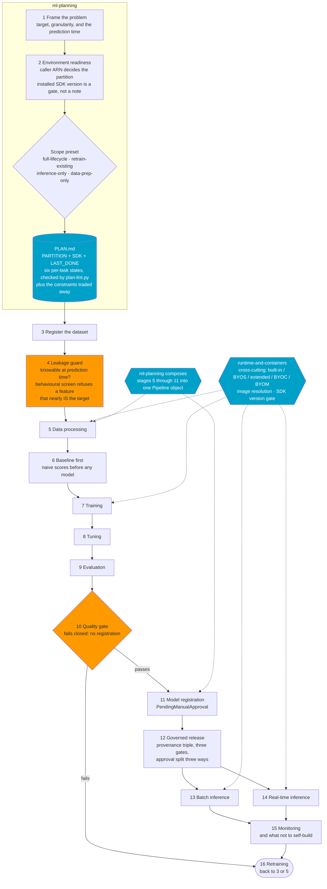

# Kiro Power: SageMaker MLDLC workflow

An AI-coding-driven machine-learning development life cycle (MLDLC) for Amazon
SageMaker — a planner that composes a run from named stages, plus one skill per stage
that can also be called on its own.

**In scope:** traditional machine learning and deep learning. Tabular regression and
classification, time-series forecasting, and models trained in a framework or a
custom container.

**Not in scope:** large-model fine-tuning. That is a different track with its own
contracts, and AWS ships an official skill for it (see [Neighbours](#neighbours)).

**Verified baseline:** the AWS China partition. The content is general — these
skills teach SageMaker, not China — but every capability claim carries a China
verdict, and the capability matrix records how each one was established. The reason
for that emphasis is not regional: a workflow that quietly does not run where its
user is, is worse than one that says so.

Version 0.1.0. Eight skills cover all sixteen stages. See [Skills](#skills).

## The flow



Ordering is a prerequisite chain: each stage's output is the next one's required
input. The dotted boxes are cross-cutting rather than stages.

## Calling one stage on its own

Stages 3, 4, 5, 6, 7, 8, 9, 12, 13, 14 and 15 are each invocable alone — "just run a
batch transform", "just build the processing job", "just screen these inputs". Naming
the stage, its prerequisites, and a one-task `PLAN.md` is the whole ceremony. A skill
covering four stages is still invoked for just one of them.

Composing stages into a `Pipeline` and calling one alone are **two uses of the same
content**, not two bodies of it. `ml-planning` composes, because deciding the stage
sequence and compiling it are one decision in two forms; each stage's own skill teaches
how to write that step.

## Skills

| Skill | Stages | Standalone | Ships a script |
|---|---|---|---|
| `ml-planning` | 1, 2, presets, `PLAN.md`, pipeline composition | orchestrator | `plan-lint.py` |
| `data-pipeline` | 3, 5 | ✔ | `contract-check.py` |
| `leakage-guard` | 4 | ✔ | |
| `train-and-tune` | 6, 7, 8 | ✔ | `training-check.py` |
| `evaluate-and-gate` | 9, 10 | ✔ | `quality-gate.py` |
| `release-and-serve` | 11, 12, 13, 14 | ✔ | |
| `monitor-and-retrain` | 15, 16 | ✔ | |
| `runtime-and-containers` | cross-cutting: 5, 7, 9, 13, 14 | ✔ | |

**Sixteen stages, eight skills, deliberately not one-to-one.** An earlier version made
them one-to-one and projected about 4,600 lines of skill body; the authoring guidance caps
a body at 500 lines because it loads on every trigger, and CRISP-DM has grouped a
comparable task list under six phases since 1996. The stage numbers survived the
consolidation unchanged, because sixteen stages map onto the six standard phases without
remainder. `docs/DESIGN.md` records the measurements.

Every stage marked standalone is still callable alone — a skill covering four stages is
still invoked for just batch inference, and the scope presets name stages rather than
skills.

## SDK v3 is the main line, and it is still moving

Measured on 2026-09-16, against PyPI and a real job in `cn-north-1`:

| Fact | Evidence |
|---|---|
| v3 is the active line | 3.22.0 released 2026-09-15; 3.0 released 2025-11-20; 22 minor releases in ten months |
| v2 is frozen, not retired | last new minor 2.257.0 on 2026-02-03; patches only since. No official end-of-support date found |
| `pip install sagemaker` gives v3 | so using v2 means pinning `<3` deliberately |
| **v3 is a package rewrite** | the top level exports nothing; packages are `ai_registry`, `core`, `lineage`, `mlops`, `serve`, `train`. Seven common v2 imports all fail |
| v3 works against the China control plane | an `ml.m5.large` XGBoost job via `ModelTrainer` in `cn-north-1` reached `Completed`, produced `model.tar.gz`, reported `train:rmse` 0.30005, billed 134 s |

So the power declares `spec.runtime.sdk` in the contract and **gates on it** rather
than shipping two sets of idioms. One gate is cheap and its refusal is informative;
two templates would double the content and drift.

Three traps this cost real time to find, all now written down in
`runtime-and-containers`: never hand-assemble an ARN (a role with an IAM path does
not exist at `role/<name>`, and SageMaker's error reads like a trust-policy
problem); pass an explicit `Session(boto_session=...)`; and `py_version="py3"` is
ignored for xgboost and sklearn but raises for pytorch.

Registry accounts are not one table — the built-in-algorithm accounts differ
**between the two China regions** (`450853457545` in Beijing, `451049120500` in
Ningxia) and again from the Deep Learning Container accounts. Resolve with
`sagemaker.core.image_uris.retrieve`; never assemble a URI.

## What actually holds, and what is only advice

Nothing here can stop an agent that has not read it. So this power classifies its
own constraints rather than presenting them as equally binding:

| Class | What it means | Examples |
|---|---|---|
| **Refusal** | honouring it produces code that declines to proceed, and a test can prove the refusal fires | the quality gate does not register a failing model · the leakage screen refuses a correlation above its declared bound · the SDK version gate stops on a mismatch · publish rejects an empty or `"null"` version id · the field-name denylist runs before schema validation · `plan-lint.py` on `PLAN.md` |
| **Accounting** | it cannot refuse, but a missing decision becomes visible | `PARTITION` / `SDK` / `LAST_DONE` in the plan · `features.assumed[].reason` · `[S]` tasks carrying `skipped: <why>` · a declared serving mode · a gate's refusal carrying the command that fixes it · a substitution recorded under "Constraints traded away" |
| **Advice** | nothing checks it; it holds while someone remembers | "prefer the least runtime mode you can get away with" · the five questions in `monitor-and-retrain` · this README staying in step with the skills |

**And one class below all three: whether a skill loads at all.** Measured at roughly
one plain request in two, with the same model and description (see
[Install](#importing-is-not-enough--add-a-steering-line)). Nothing inside a skill
affects it — content is only reachable once the skill is in context, so every row of
the table above is conditional on activation. A project steering line is the only
thing observed to make it deterministic, which is why that is an install step rather
than a tip.

The third column is the honest one. It comes from an audit of this power's
predecessor on a real end-to-end run: **constraints written as a refusal survived
into the artefacts; constraints that stayed prose either held by luck or went
missing without a trace.** In that run a metric from the default list went
unimplemented and nothing caught it — which is why omissions must now be declared
rather than merely avoided.

## The measurement that shaped stage 6

A validation run reported MAE 18.8 against a quality gate of 130. Every structural
check passed. The gate passed.

One column, used **directly as the prediction with no model at all**, scored 14.18 —
better than the trained model — correlating 0.975 with a target whose standard
deviation was 232. It was a settlement quantity derived from realized outcomes, and
its name suggested a price contracted in advance.

```
naive: predict the mean            MAE 182.71
naive: same period yesterday       MAE 137.06
the suspect column, used as-is     MAE  14.18   corr 0.975   ← the leak
the trained model                  MAE  18.76   ← worse than the leak alone
```

Two things follow, and both are now structural. `train-and-tune` makes the naive
scores a required output, so an implausible result is visible on sight.
`leakage-guard`'s behavioural screen is a **refusal**, because sorting features by
name is a hypothesis and names lie.

## No MCP server, on purpose

Three reasons, in increasing order of weight.

1. **The dedicated server does not help here.**
   `awslabs.sagemaker-ai-mcp-server` is at 1.1.0 and covers SageMaker HyperPod only
   — the one capability the China partition lacks entirely. Zero usable tools for
   this power's verified baseline.
2. **That line has an official successor.** `awslabs/mcp` now states the Agent
   Toolkit for AWS "is the successor to the MCP servers, plugins, and skills
   available on AWS Labs" and that "over time, the most useful projects here will
   move into Agent Toolkit for AWS". Welding an awslabs MCP into `mcp.json` bets on
   a line its own maintainers call superseded.
3. **An MCP does not solve this power's problem.** MCP servers wrap AWS *APIs*; the
   hard part here is generating *correct code*. Seven dead imports, an ARN path, a
   session that does not inherit its profile, and a config shim mid-move are all
   code-generation failures. No MCP prevents any of them; a skill naming the
   canonical paths and a version gate do.

**Optional companion, not bundled:** the AWS Knowledge MCP Server at
`https://knowledge-mcp.global.api.aws` needs no AWS credentials and answers a real
MCP handshake. It addresses exactly the failure mode this README is full of — the
SDK moved and a model's training data did not. It is not in `mcp.json` because
`mcp.json` cannot load conditionally per region, so bundling would push it onto
every user. Whether it is reachable from a given network inside China was **not**
established: one probe succeeded from one machine whose egress path is not
characterised, against a CloudFront-fronted endpoint. Re-run the handshake from your
own network before depending on it.

## Install

Kiro → Powers panel → **Add Custom Power** → **Import power from GitHub** (paste the
repository URL) or **Import power from a folder**.

Requires Kiro IDE, Kiro on the web, or Kiro CLI v3+. Choose **Vibe** when Kiro asks
— skills trigger reliably in vibe mode and less consistently in spec mode.

Kiro **copies** a power into `~/.kiro/powers/installed/` at import time, so changes
to your clone need a re-import to take effect.

### Importing is not enough — pick one of the deterministic ways in

Skill activation is a model judgement, not a rule. Measured on one machine with one
model (GPT-5.6 Terra, vibe mode, identical prompt), a plain request activated
`ml-planning` **twice out of four times**; on the two misses a global skill in
`~/.kiro/skills/` won the match instead. Rewording the description did not fix it —
the run immediately after the description was widened still missed.

Four ways in, and three of them do not depend on that judgement:

| Way in | Setup | Per use | Reliability |
|---|---|---|---|
| **Type `/ml-planning`** | none | four keystrokes | by name, no matching |
| **Project steering file** | one file, once | none | **measured 3/3** |
| **Try power** button | none | one click per session | engages the power, then asks for an overview |
| Plain request | none | none | **about 1 in 2** |

**`/ml-planning` is the cheapest.** Importing the power registers all eight skills as
slash commands in the composer, each with its description, so typing `/ml` narrows to
one — none of the thirteen global skills on the test machine starts with those
letters, and none collides with a name in this power. It addresses the failure
directly: the same crowded match pool that loses the coin flip has no effect when the
skill is called by name.

Its limit is that the user has to know which skill to call. For the planner that is
fine — `ml-planning` is the answer to "I do not know which one" — but picking among
five puts a decision on the person who should not have to make it. So the slash
command is the zero-setup entry, and the steering file is what removes even those four
keystrokes.

```markdown
---
inclusion: always
---

Machine-learning work in this repository goes through the `sagemaker-mldlc-workflow`
power. Start with its `ml-planning` skill and follow the workflow it defines.
```

Put that at `.kiro/steering/ml-workflow.md`, or copy the one this power ships:

```bash
mkdir -p .kiro/steering
cp ~/.kiro/powers/installed/sagemaker-mldlc-workflow/steering/getting-started.md \
   .kiro/steering/ml-workflow.md
```

Steering files are loaded unconditionally rather than matched, which is why this
removes the coin flip. This is not a quirk of this power — AWS's own Agent Toolkit
documents the same requirement for its skills. Kiro also reads `~/.kiro/steering/`,
listed as **Global** in its steering panel, so one file there covers every project at
the cost of applying to projects that are not about machine learning.

**The `steering/` directory this power ships does not fire on its own.** It was
measured: with `POWER.md` and `steering/getting-started.md` both installed, an
activation reported that it received no `POWER.md` body and no steering guide, and
fell back to reading the skills. `POWER.md` supplies the power page — the title, the
`by` line, the keyword tags, the description — and `steering/` is the copy-source for
the command above. Neither replaces the project file. The twelve official powers that
ship `steering/` are pure-legacy, with no `plugin.json`; whether that is what makes
the difference was not tested, because finding out costs the cross-harness
portability the plugin format buys.

**Two manifests, two audiences.** The power page renders `POWER.md`; the activation
result an agent receives carries `plugin.json`'s description instead — established by
the fact that the activation text contains a sentence only `plugin.json` has and omits
the setup line only `POWER.md` has. So page text reaches the human and skill text
reaches the agent, which is why the setup prompt also lives in `ml-planning` itself.

## Validate

```bash
python3 scripts/validate.py            # uses the pinned schema in schemas/
python3 scripts/validate.py --refresh  # re-fetch the schema first
```

Validates `plugin.json` against the [Agent Plugins 1.0.0](https://agent-plugins.org/)
schema, checks that every skill has a `SKILL.md` whose frontmatter `name` matches its
directory, and cross-checks the stage catalogue against `skills/` and against
`ml-planning`'s own stage table. A schema it cannot load is a hard failure, not a
warning — a validator reporting success while skipping its main check is worse than no
validator.

Four skills ship a check of their own. Each corresponds to rules in its skill body, and
each exists as a script rather than as prose for one reason: **a rule that can refuse
holds, and a rule that stays prose holds only while someone remembers it.**

```bash
python3 skills/ml-planning/scripts/plan-lint.py PLAN.md
python3 skills/data-pipeline/scripts/contract-check.py \
        contracts/dataset-manifest.json artifacts/processing-report.json
python3 skills/train-and-tune/scripts/training-check.py \
        artifacts/baseline-report.json artifacts/training-report.json \
        artifacts/tuning-report.json
python3 skills/evaluate-and-gate/scripts/quality-gate.py \
        contracts/quality-gate-contract.json artifacts/evaluation-report.json \
        --out artifacts/quality-gate-report.json
```

| Script | Refuses on |
|---|---|
| `plan-lint.py` | numbering, one state marker per task, at most one `[-]`, no `[x]` above an unsettled task, `[S]` without a reason, `[!]` without `refused:` and a `blocks:` list none of whose tasks are done, `LAST_DONE` disagreeing with the highest `[x]`, and a `Skill:` that does not match the owner its `Stage:` implies |
| `contract-check.py` | a dataset identity with a hole, a `versionId` that is null or the string `"null"`, an unverified read-back, an absent completeness assertion, partition counts that do not reconcile, a group key in two partitions, overlapping boundaries, a transform fitted outside the training partition, outputs with no digest |
| `training-check.py` | no baselines, the weaker baseline named as strongest, a bound not derived from it, an image pinned by tag, a test channel in training or tuning, no model artefact, undeclared candidates, a winner not recorded as fixed before test access |
| `quality-gate.py` | **it computes the verdict rather than checking one** — a contract that cannot be shown to predate the predictions, a model worse than a recorded baseline, an unexplained missing metric, no independent recomputation, or a hand-written verdict that disagrees. Exits non-zero on `REFUSED`, so a failing gate stops a step instead of producing a document someone has to read |

Every refusal above was verified by breaking a fixture one field at a time. The gate was
additionally run against a real end-to-end run's numbers and independently reached the
same `REFUSED`.

## Neighbours

- **AWS's own `aws-ai-ml` skill**, in the Agent Toolkit for AWS registry — model
  selection, fine-tuning (SFT, DPO, RLVR, RLAIF), evaluation, endpoint diagnostics,
  PySDK v3 usage. States it is not for Ground Truth, Feature Store or general AWS
  infrastructure. Its shape is large-model customisation, so it does not cover the
  traditional-ML and DL training lifecycle this power is about.
- **`kiro-power-sagemaker-ai`** — packages AWS's upstream `sagemaker-ai` plugin, 19
  skills, also shaped for large-model fine-tuning.
- **`kiro-power-sagemaker-tabular-mlops`** — this power's predecessor, kept rather
  than migrated: it carries a complete end-to-end validation record and serves as
  the reference implementation and regression comparison. `release-and-serve` and
  `monitor-and-retrain` come from it; the first differs from its source
  only in two cross-references, the second is byte-identical.

## Provenance and scope

The patterns here are drawn from a production forecasting platform running in the
China (Ningxia) Region, plus measurements taken read-only against a China account in
September 2026 with `us-west-2` probed identically as a control. Verdicts taken from
AWS documentation are labelled as such; `docs/DESIGN.md` records which claims were
measured, which were run end to end, and which were only documented.

**Only patterns travel.** No customer identity, account, bucket, resource name,
internal URL or business logic appears. Where a specific value is given it is either
published by AWS (the registry accounts) or a measured error string quoted as
returned by the API.

Deliberately **out of scope**, stated rather than improvised: probabilistic and
quantile forecasting; data generation and labelling (SageMaker Ground Truth is closed
to new customers in every partition); endpoint right-sizing, for which there is no
sizing service in the China partition and no substitute worth pretending about;
adversarial label leakage and privacy-motivated feature exclusion.

## License

Apache-2.0.
